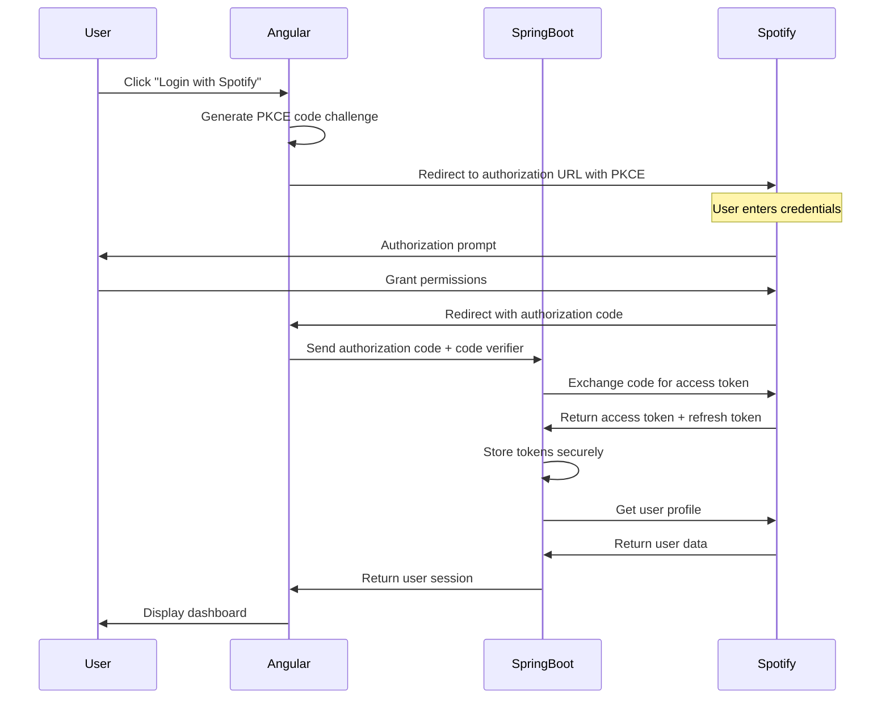

# Spotify Read-Only Dashboard - Technical Specification

## Table of Contents
- [Overview](#overview)
- [Architecture](#architecture)
- [OAuth 2.0 Authentication](#oauth-20-authentication)
- [API Integration](#api-integration)
- [Data Models](#data-models)
- [Error Handling](#error-handling)
- [Security Considerations](#security-considerations)
- [Performance & Rate Limiting](#performance--rate-limiting)
- [Implementation Details](#implementation-details)

## Overview

### Project Description
A full-stack web application that integrates with Spotify's Web API to display read-only music data including current playback status, recently played tracks, user profile information, and music library details with an aurora-themed visual design.

### Key Requirements
- **Read-only access** to Spotify user data
- **Full-stack architecture** with Angular frontend and Spring Boot backend
- **OAuth 2.0 Authorization Code with PKCE** authentication flow
- **Real-time updates** for playback information
- **Responsive design** for desktop and mobile
- **Aurora-themed UI** with northern lights animations
- **Works with free and premium Spotify accounts**

### Technology Stack
- **Frontend**: Angular 17 with TypeScript, Angular Material UI
- **Backend**: Spring Boot 3.2.1 with Java 17, Spring Data JPA
- **Database**: PostgreSQL for user data and music metadata caching
- **Authentication**: OAuth 2.0 Authorization Code with PKCE Flow
- **API Integration**: Spotify Web API v1
- **Containerization**: Docker for both frontend and backend

## Architecture

### System Architecture
```
┌─────────────────────┐    ┌─────────────────────┐    ┌─────────────────┐
│    Angular SPA      │    │   Spring Boot API   │    │  Spotify API    │
│      Frontend       │    │      Backend        │    │                 │
│ ┌─────────────────┐ │    │ ┌─────────────────┐ │    │ ┌─────────────┐ │
│ │  Aurora UI      │ │    │ │  OAuth Handler  │ │    │ │   Web API   │ │
│ │  Components     │◄┼────┼►│  API Proxy      │◄┼────┼►│  Endpoints  │ │
│ │  Music Dashboard│ │    │ │  Data Cache     │ │    │ │             │ │
│ └─────────────────┘ │    │ └─────────────────┘ │    │ └─────────────┘ │
│                     │    │          │          │    │                 │
│                     │    │ ┌─────────────────┐ │    │                 │
│                     │    │ │   PostgreSQL    │ │    │                 │
│                     │    │ │    Database     │ │    │                 │
│                     │    │ └─────────────────┘ │    │                 │
└─────────────────────┘    └─────────────────────┘    └─────────────────┘
        Port: 4200                Port: 8080
```

### Frontend Component Structure (Angular)
```
src/app/
├── components/
│   ├── aurora-background/       # Background animation component
│   ├── current-playback/        # Current track display
│   ├── listening-history/       # Recent tracks list
│   ├── top-artists/            # User's top artists
│   ├── audio-analysis/         # Track audio features
│   ├── podcast-section/        # Recent podcasts
│   └── user-playlists/         # User's playlists
├── services/
│   ├── auth.service.ts         # Spotify OAuth handling
│   ├── spotify-api.service.ts  # Backend API communication
│   ├── user.service.ts         # User data management
│   └── playback.service.ts     # Real-time playback updates
├── interfaces/
│   ├── user.interface.ts       # User data types
│   ├── track.interface.ts      # Track data types
│   └── playback.interface.ts   # Playback state types
└── shared/
    ├── material.module.ts      # Angular Material components
    └── pipes/                  # Custom pipes for data formatting
```

### Backend Component Structure (Spring Boot)
```
src/main/java/com/workshop/
├── controller/
│   ├── AuthController.java     # OAuth flow endpoints
│   ├── UserController.java     # User data endpoints
│   ├── PlaybackController.java # Current playback endpoints
│   └── SpotifyController.java  # Spotify API proxy
├── service/
│   ├── SpotifyAuthService.java # OAuth token management
│   ├── SpotifyApiService.java  # Spotify Web API integration
│   ├── UserService.java        # User data business logic
│   └── CacheService.java       # Data caching logic
├── entity/
│   ├── User.java              # User entity
│   ├── Track.java             # Track entity
│   ├── Artist.java            # Artist entity
│   └── AudioFeatures.java     # Audio features entity
├── repository/
│   ├── UserRepository.java    # User data access
│   ├── TrackRepository.java   # Track data access
│   └── ArtistRepository.java  # Artist data access
├── dto/
│   ├── AuthTokenDto.java      # OAuth token response
│   ├── CurrentPlaybackDto.java # Playback state response
│   └── TrackDto.java          # Track data response
└── config/
    ├── SecurityConfig.java    # Security configuration
    ├── WebConfig.java         # CORS and web configuration
    └── DatabaseConfig.java    # Database configuration
```

## OAuth 2.0 Authentication

### Flow Type: Authorization Code with PKCE
The Authorization Code with PKCE flow is used for secure authentication in single-page applications, providing better security than the deprecated Implicit Grant flow.

### Authentication Flow Sequence



### OAuth Configuration

#### App Registration Details
```javascript
const SPOTIFY_CONFIG = {
  CLIENT_ID: 'client-id',
  RESPONSE_TYPE: 'token',
  REDIRECT_URIS: [
    'http://localhost/callback',
    'http://127.0.0.1/callback',
    'https://localhost/callback',
    'https://127.0.0.1/callback'
  ],
  SCOPES: [
    'user-read-currently-playing',
    'user-read-recently-played', 
    'user-read-private',
    'user-library-read',
    'playlist-read-private',
    'user-top-read'
  ]
};
```

#### Authorization URL Construction
```javascript
function buildAuthUrl() {
  const params = new URLSearchParams({
    client_id: S_CLIENT_ID,
    response_type: 'token',
    redirect_uri: REDIRECT_URI,
    scope: SCOPES.join(' '),
    show_dialog: 'true'
  });
  
  return `https://accounts.spotify.com/authorize?${params.toString()}`;
}
```

#### Token Extraction
```javascript
function extractTokenFromCallback() {
  const hash = window.location.hash.substring(1);
  const params = new URLSearchParams(hash);
  
  return {
    access_token: params.get('access_token'),
    token_type: params.get('token_type'),
    expires_in: params.get('expires_in'),
    state: params.get('state'),
    error: params.get('error')
  };
}
```

### Token Management

#### Storage Strategy
- **Location**: Browser memory (variables)
- **Persistence**: Session-based (cleared on page refresh)
- **Security**: No persistent storage to minimize exposure

#### Token Validation
```javascript
async function validateToken(token) {
  try {
    const response = await fetch('https://api.spotify.com/v1/me', {
      headers: {
        'Authorization': `Bearer ${token}`
      }
    });
    return response.ok;
  } catch (error) {
    return false;
  }
}
```

#### Expiration Handling
- **Token Lifetime**: 1 hour (3600 seconds)
- **Refresh Strategy**: Manual re-authentication required
- **Expiration Detection**: HTTP 401 responses

## API Integration

### Base Configuration
```javascript
const API_CONFIG = {
  BASE_URL: 'https://api.spotify.com/v1',
  RATE_LIMIT: 100, // requests per minute
  RETRY_ATTEMPTS: 3,
  TIMEOUT: 10000 // 10 seconds
};
```

### Core Endpoints

#### 1. User Profile
```javascript
GET /v1/me
Headers: Authorization: Bearer {token}
Response: UserProfile object
```

#### 2. Currently Playing Track
```javascript
GET /v1/me/player/currently-playing
Headers: Authorization: Bearer {token}
Query Params: market, additional_types
Response: CurrentlyPlaying object | 204 No Content
```

#### 3. Recently Played Tracks
```javascript
GET /v1/me/player/recently-played
Headers: Authorization: Bearer {token}
Query Params: limit (1-50), after, before
Response: RecentlyPlayed object
```

#### 4. User's Top Items
```javascript
GET /v1/me/top/{type}
Headers: Authorization: Bearer {token}
Path Params: type (artists|tracks)
Query Params: time_range, limit, offset
Response: Paging<Artist|Track>
```

#### 5. User's Playlists
```javascript
GET /v1/me/playlists
Headers: Authorization: Bearer {token}
Query Params: limit, offset
Response: Paging<Playlist>
```

### HTTP Client Implementation
```javascript
class SpotifyAPIClient {
  constructor(accessToken) {
    this.accessToken = accessToken;
    this.baseURL = 'https://api.spotify.com/v1';
  }

  async makeRequest(endpoint, options = {}) {
    const url = `${this.baseURL}${endpoint}`;
    const config = {
      method: 'GET',
      headers: {
        'Authorization': `Bearer ${this.accessToken}`,
        'Content-Type': 'application/json',
        ...options.headers
      },
      ...options
    };

    try {
      const response = await fetch(url, config);
      
      if (!response.ok) {
        throw new APIError(response.status, await response.json());
      }
      
      if (response.status === 204) {
        return null; // No content
      }
      
      return await response.json();
    } catch (error) {
      throw this.handleError(error);
    }
  }

  handleError(error) {
    if (error.status === 401) {
      // Token expired or invalid
      this.onTokenExpired();
    } else if (error.status === 429) {
      // Rate limited
      const retryAfter = error.headers.get('Retry-After');
      throw new RateLimitError(retryAfter);
    }
    throw error;
  }
}
```

## Data Models

### User Profile
```typescript
interface UserProfile {
  id: string;
  display_name: string;
  email?: string;
  followers: {
    href: string | null;
    total: number;
  };
  images: Image[];
  country: string;
  product: 'free' | 'premium';
  external_urls: ExternalUrls;
}
```

### Currently Playing Track
```typescript
interface CurrentlyPlaying {
  device: Device;
  repeat_state: 'off' | 'track' | 'context';
  shuffle_state: boolean;
  context: Context | null;
  timestamp: number;
  progress_ms: number | null;
  is_playing: boolean;
  item: Track | Episode | null;
  currently_playing_type: 'track' | 'episode' | 'ad' | 'unknown';
}
```

### Track Object
```typescript
interface Track {
  id: string;
  name: string;
  artists: Artist[];
  album: Album;
  duration_ms: number;
  explicit: boolean;
  external_urls: ExternalUrls;
  href: string;
  is_local: boolean;
  popularity: number;
  preview_url: string | null;
  track_number: number;
  type: 'track';
  uri: string;
}
```

### Recent Tracks
```typescript
interface RecentlyPlayed {
  items: PlayHistory[];
  next: string | null;
  cursors: {
    after: string;
    before: string;
  };
  limit: number;
  href: string;
}

interface PlayHistory {
  track: Track;
  played_at: string; // ISO 8601 timestamp
  context: Context | null;
}
```

## Error Handling

### Error Types and Handling Strategy

#### 1. Authentication Errors (401)
```javascript
class AuthenticationError extends Error {
  constructor(message) {
    super(message);
    this.name = 'AuthenticationError';
    this.status = 401;
  }
}

// Handling
function handleAuthError() {
  // Clear stored token
  accessToken = null;
  // Redirect to login
  showLoginScreen();
  // Show user-friendly message
  showError('Please log in again to continue');
}
```

#### 2. Rate Limiting (429)
```javascript
class RateLimitError extends Error {
  constructor(retryAfter) {
    super('Rate limit exceeded');
    this.name = 'RateLimitError';
    this.status = 429;
    this.retryAfter = retryAfter;
  }
}

// Handling with exponential backoff
async function handleRateLimit(error) {
  const delay = error.retryAfter * 1000 || 1000;
  await new Promise(resolve => setTimeout(resolve, delay));
  // Retry the request
}
```

#### 3. Network Errors
```javascript
function handleNetworkError(error) {
  console.error('Network error:', error);
  showError('Connection problem. Please check your internet.');
  // Implement retry logic with exponential backoff
}
```

#### 4. API Errors (4xx, 5xx)
```javascript
function handleAPIError(error) {
  const errorMessages = {
    400: 'Bad request. Please try again.',
    403: 'Access forbidden. Check your permissions.',
    404: 'Requested resource not found.',
    500: 'Spotify server error. Please try again later.',
    503: 'Spotify service unavailable. Please try again later.'
  };
  
  const message = errorMessages[error.status] || 'An unexpected error occurred.';
  showError(message);
}
```

## Security Considerations

### Token Security
- **No Persistent Storage**: Tokens stored only in memory
- **HTTPS Only**: All API calls use HTTPS
- **Scope Limitation**: Request minimal required scopes
- **Token Validation**: Validate tokens before API calls

### CORS and CSP
```html
<!-- Content Security Policy -->
<meta http-equiv="Content-Security-Policy" 
      content="default-src 'self'; 
               connect-src 'self' https://api.spotify.com https://accounts.spotify.com; 
               img-src 'self' https://*.scdn.co data:; 
               style-src 'self' 'unsafe-inline';">
```

### Input Validation
```javascript
function sanitizeUserInput(input) {
  // Remove HTML tags and dangerous characters
  return input
    .replace(/<[^>]*>/g, '')
    .replace(/[<>&"']/g, '')
    .trim();
}
```

## Performance & Rate Limiting

### Rate Limits
- **Spotify Limits**: 100 requests per minute per application
- **Implementation**: Client-side request throttling
- **Retry Logic**: Exponential backoff for 429 responses

### Caching Strategy
```javascript
class APICache {
  constructor(ttl = 60000) { // 1 minute default TTL
    this.cache = new Map();
    this.ttl = ttl;
  }

  set(key, data) {
    this.cache.set(key, {
      data,
      timestamp: Date.now()
    });
  }

  get(key) {
    const item = this.cache.get(key);
    if (!item) return null;
    
    if (Date.now() - item.timestamp > this.ttl) {
      this.cache.delete(key);
      return null;
    }
    
    return item.data;
  }
}
```

### Performance Optimizations
- **Image Lazy Loading**: Load album art as needed
- **Request Batching**: Combine related API calls
- **Data Pagination**: Load data in chunks
- **Debounced Updates**: Limit real-time update frequency

## Implementation Details

### Application Lifecycle
```javascript
class SpotifyApp {
  constructor() {
    this.apiClient = null;
    this.cache = new APICache();
    this.updateInterval = null;
  }

  async initialize() {
    // Check for existing token in URL
    const token = this.extractTokenFromURL();
    
    if (token) {
      await this.authenticateWithToken(token);
    } else {
      this.showLoginScreen();
    }
  }

  async authenticateWithToken(token) {
    this.apiClient = new SpotifyAPIClient(token);
    
    try {
      const user = await this.apiClient.getUserProfile();
      this.showDashboard(user);
      this.startDataUpdates();
    } catch (error) {
      this.handleAuthenticationError(error);
    }
  }

  startDataUpdates() {
    this.updateInterval = setInterval(() => {
      this.refreshDashboardData();
    }, 10000); // Update every 10 seconds
  }

  async refreshDashboardData() {
    try {
      const [currentTrack, recentTracks] = await Promise.all([
        this.apiClient.getCurrentTrack(),
        this.apiClient.getRecentTracks()
      ]);
      
      this.updateUI(currentTrack, recentTracks);
    } catch (error) {
      this.handleDataError(error);
    }
  }
}
```

### Local Development Setup
```bash
# Method 1: Python HTTP Server
python -m http.server 80

# Method 2: Node.js HTTP Server
npx http-server -p 80

# Method 3: PHP Built-in Server
php -S localhost:80

# Access the application
# http://localhost/spotify-dashboard.html
```

### Environment Configuration
```javascript
const CONFIG = {
  development: {
    S_CLIENT_ID: '',
    REDIRECT_URI: 'http://localhost/callback',
    API_BASE_URL: 'https://api.spotify.com/v1',
    DEBUG: true
  },
  production: {
    S_CLIENT_ID: '',
    REDIRECT_URI: 'https://yourdomain.com/callback',
    API_BASE_URL: 'https://api.spotify.com/v1',
    DEBUG: false
  }
};
```

### Build and Deployment
Since this is a static client-side application:

1. **No Build Process Required**: Pure HTML/CSS/JS
2. **Static Hosting**: Can be deployed to any static file server
3. **CDN Friendly**: All assets are static
4. **HTTPS Required**: For production deployment

### Browser Compatibility
- **Modern Browsers**: Chrome 60+, Firefox 55+, Safari 11+, Edge 79+
- **Required Features**: 
  - ES6+ support
  - Fetch API
  - URLSearchParams
  - CSS Grid/Flexbox

---

## Conclusion

This technical specification provides a comprehensive guide for implementing a read-only Spotify dashboard using the Web API and OAuth 2.0 Implicit Grant flow. The implementation prioritizes security, performance, and user experience while maintaining simplicity for client-side deployment.